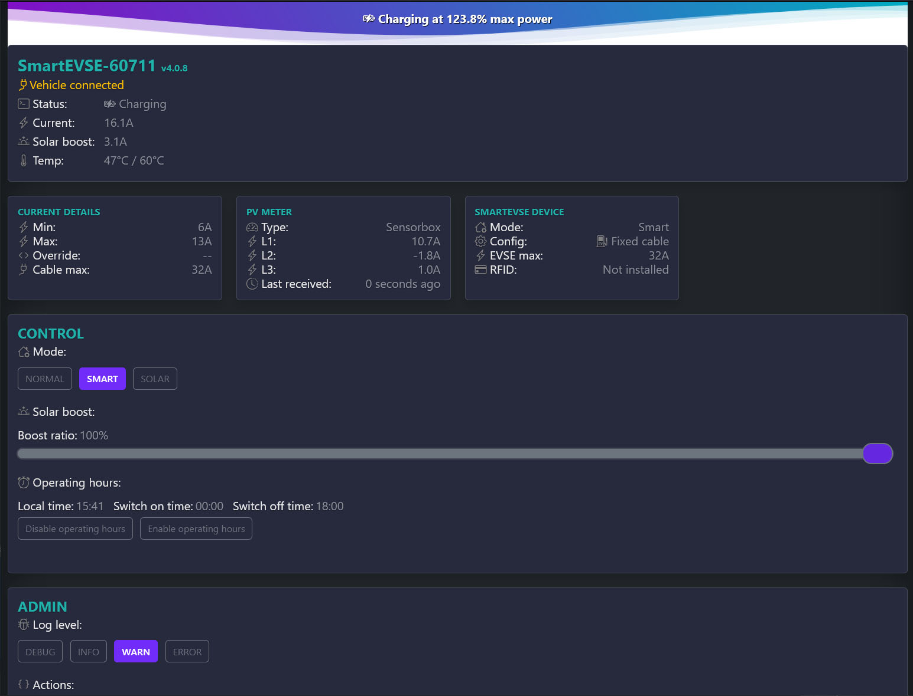
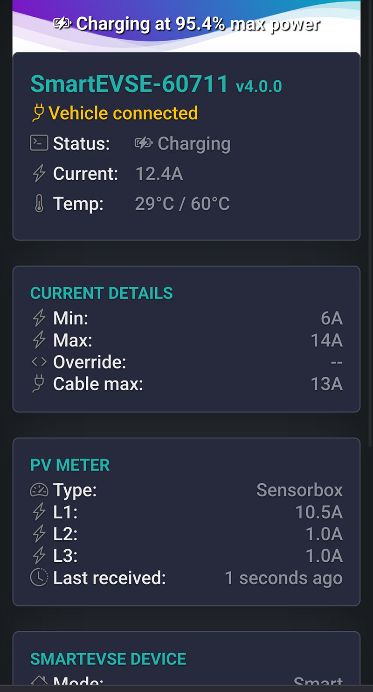
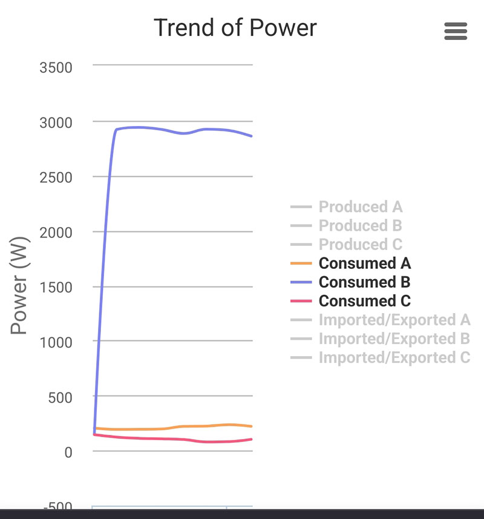
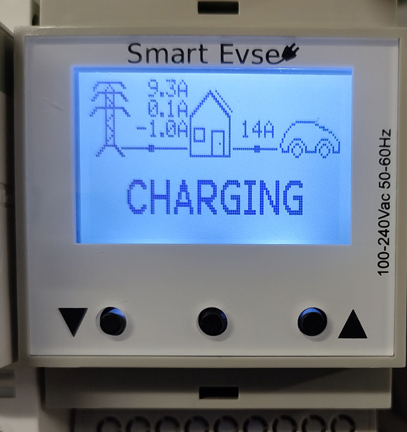

SmartEVSE v3
=========

Changes to original firmware v3.0.0
- Massive code refactor to C++ objects
- New web status page (UI design, Rest API and no webSockets)
- New max EVSE temperature menu and settings
- New RGB leds enabled/disabled menu and settings
- Device screen on Smart/Solar mode renders decimal amps for phases consumption
- Fixed smart mode power rebalance on 3 phases grid
- Improved timers and tasks
- Special thanks to **serkri** for his work (https://github.com/serkri/SmartEVSE-3)









## Setting up WiFi

> Documentation from: https://github.com/tzapu/WiFiManager

- From SmartEVSE menu select `WIFI` option and `SetupWifi` suboption
- In 5 seconds Wifi portal will start and SmartEVSE will display Wifi access point name and password
- using any wifi enabled device with a browser (computer, phone, tablet) connect to the newly created Access Point
- because of the Captive Portal and the DNS server you will either get a 'Join to network' type of popup or get any domain you try to access redirected to the configuration portal
- choose one of the access points scanned, enter password, click save
- SmartEVSE will try to connect. If successful, it relinquishes control back to your app. If not, reconnect to AP and reconfigure.

- When your SmartEVSE starts up, it sets it up in Station mode and tries to connect to a previously saved Access Point
- if this is unsuccessful (or no previous network saved) it moves the SmartEVSE into Access Point mode and spins up a DNS and WebServer (default ip 192.168.4.1)

 


$~$
## Building the firmware
* Install platformio-core https://docs.platformio.org/en/latest/core/installation/methods/index.html
* Compile `firmware.bin`: platformio run
* Compile `spiffs.bin`: platformio run -t buildfs

$~$
## Flashing the device

> [!CAUTION]
> YOU CANNOT FLASH THE DEVICE WITH ANOTHER FILENAME rather than `firmware.bin`!

### Option 1: WiFi flashing
* Configure SmartEVSE WiFi
* Open device `/update` endpoint on browser without HTTPS *(ex: http://your-smartevse-address/update)*
* Select the `firmware.bin` archive
* After OK, select `spiffs.bin`
* If you get FAIL, check your wifi connection and try again
* After OK, wait 10-30 seconds and your new firmware including the webserver should be online!


$~$
### Option 2: USB flashing (Windows OS)
* InstallDriver for Virtual Port https://www.silabs.com/documents/public/software/CP210x_VCP_Windows.zip
* Open `platformio.ini` file and replace COM4 port with your SmartEVSE device port (check via Windows device manager)
* Upload via USB configured in platformio.ini: platformio run --target upload


$~$
### Embeded webserver HTML content
* Update partition with `spiffs.bin` previously built 


$~$
## Erasing flash memory from the device / factory reset
* `pip install esptool`
* Download boot section `https://github.com/SmartEVSE/SmartEVSE-3/files/8864695/boot_app0.zip`
* extract `boot_app0.zip`
* Replace COM4 port with your SmartEVSE device port (check via Windows device manager)


```
esptool.py.exe --chip esp32 --port COM4 --before default_reset --after hard_reset write_flash 0xe000 boot_app0.bin
```
```
esptool.py.exe --chip esp32 --port COM4 --before default_reset --after hard_reset erase_region 0xe000 0x2000
```
```
esptool.py.exe --chip esp32 --port COM4 erase_flash
```
