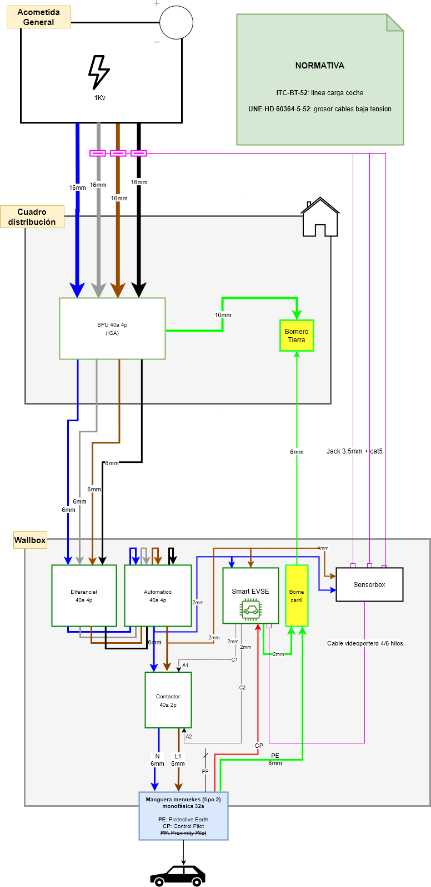
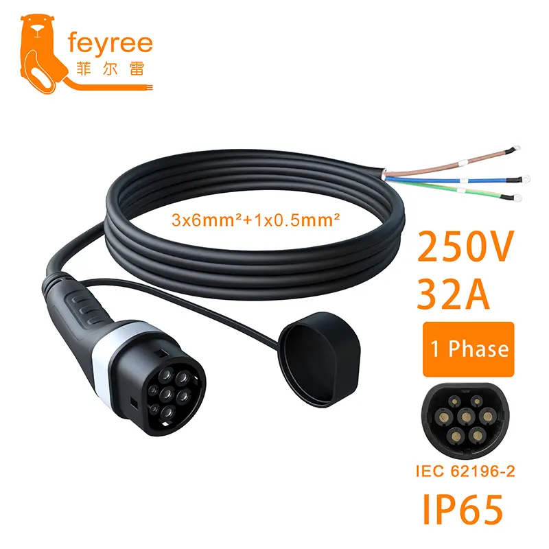

# How to install your SmartEVSE device

> [!NOTE]
> These are the Spanish regulations that applies to EV charging: ITC-BT-52 AND UNE-HD 60364-5-52

This is the wiring diagram for a single phase or 3 phases grid, powering a 1 phase charger

$~$

# Hardware used in this setup

- [Official Smart EVSE v3 device](https://www.stegen.com/en/ev-products/66-smart-evse-controller.html)
- [Official Sensorbox plus](https://www.stegen.com/en/ev-products/144-smart-evse-sensorbox-plus.html)
- [Official Current transformer](https://www.stegen.com/en/ev-products/142-current-transformer-80a.html) *(1 unit per phase)*

- [Surge arrester 40A 4p](https://www.se.com/es/es/product/A9L20740/limitador-de-sobretensiones-transitorias-y-permanentes-iga-acti9-combi-spu-3p+n-40a/) (*Note: use the 2p version for a single phase grid*)
- [Differential switch 40A 4p](https://www.se.com/es/es/product/A9R61440/interruptor-diferencial-acti9-iid-4p-40a-30ma-asi/) (*Note: a 2p differential is also valid*)
- [Circuit breaker switch 40A 4p](https://www.se.com/es/es/product/A9F79440/interruptor-magnetot%C3%A9rmico-acti9-ic60n-4p-40-a-curva-c-6000-a-10-ka/) (*Note: a 2p circuit breaker is also valid*)
- [Contactor 40A 2p normally open](https://www.se.com/es/es/product/A9C20842/contactor-modular-acti9-ict-40-a-2-p-2-na-230-240v-ca/)
- [Enclosure IP65 with DIN rail](https://amzn.eu/d/fZdd9F9)
- [Type 2 female cable 1 phase 32A](https://www.aliexpress.com/item/1005006746361767.html)

### Type 2 female cable (1 phase 32A) picture
$~$

